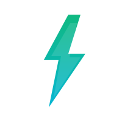
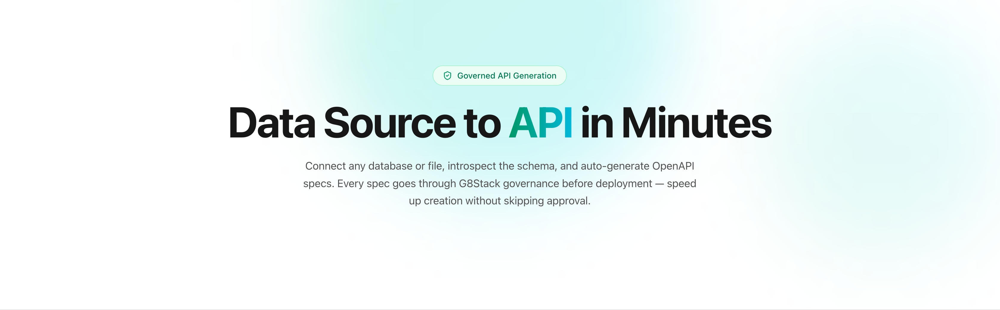

  

  

  
  
  
  
  

# G8Connect

**Data Source to API in Minutes** — connect any database or file, introspect the schema, and auto-generate OpenAPI specs. Every spec goes through G8Stack governance before deployment.

## Documentation

- [Getting Started](docs/01-getting-started/01-installation.md)
- [Development](docs/02-development/README.md)
  - [Code Quality](docs/03-architecture/01-code-quality.md)
  - [Secure File Access](docs/02-development/08-secure-file-access.md)
  - [Upload Helper](docs/02-development/07-upload-helper.md)
- [Deployment](docs/04-deployment/01-deployment.md)
- [Full Documentation](docs/README.md)

## Contributing

Thank you for considering contributing to G8Connect! The contribution guide can be found in the [Laravel documentation](https://laravel.com/docs/contributions).

## Code of Conduct

In order to ensure that the community is welcoming to all, please review and abide by the [Code of Conduct](https://laravel.com/docs/contributions#code-of-conduct).

## Security Vulnerabilities

If you discover a security vulnerability within G8Connect, please send an e-mail to g8stack. All security vulnerabilities will be promptly addressed.

## Contributors

## License

G8Connect is open-sourced software licensed under the [MIT license](https://opensource.org/licenses/MIT).
