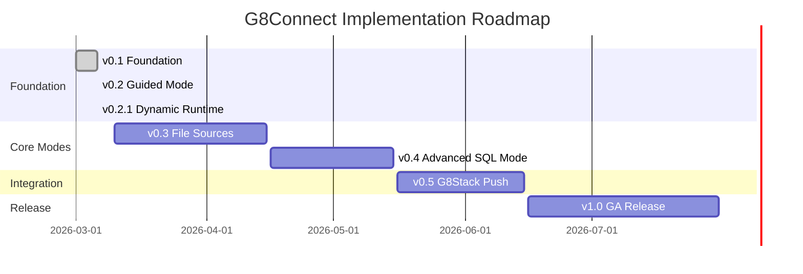
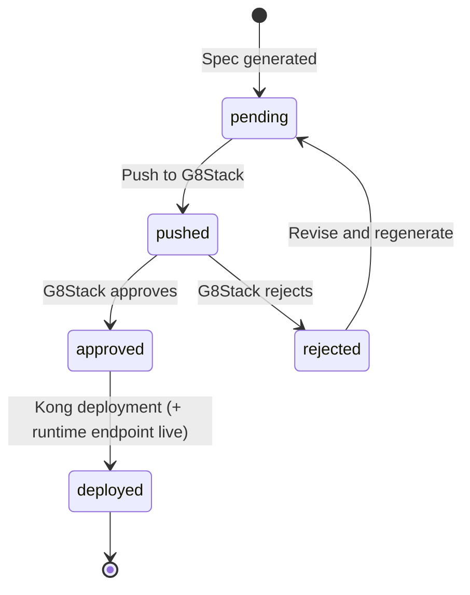
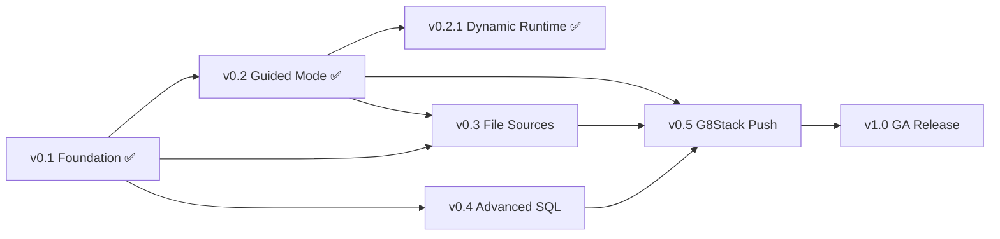

# Implementation Roadmap

G8Connect accelerates API creation from any data source while enforcing governance
through G8Stack. Every phase outputs drafts — nothing deploys without G8Stack approval.

> **Core principle**: Speed up API creation, don't skip governance.

## Phase Summary

| Phase | Name | Scope | Target | Status |
|---|---|---|---|---|
| v0.1 | Foundation | Auth + DB connections + Simple Mode | Internal / Dev | Done |
| v0.2 | Guided Mode | Field selection, methods, filters, versioning | Beta | Done |
| v0.2.1 | Dynamic Runtime | Serve deployed specs as live CRUD endpoints | Beta | Done |
| v0.3 | File Sources | CSV, JSON, Excel | Beta | Planned |
| v0.4 | Advanced Mode | SQL queries to GET endpoints | GA prep | Planned |
| v0.5 | G8Stack Push | Spec submission + status tracking | GA | Planned |
| v1.0 | GA Release | Polish, audit, PII hardening, docs | Public | Planned |

## Timeline



## v0.1 — Foundation ✅

**Goal**: Connect to a database, introspect schema, expose all fields as a CRUD spec automatically. Simple Mode only.

**Status**: Complete (2026-03-06)

### Scope

- Project scaffolding (Laravel 12, Livewire, roles/permissions, Keycloak SSO skeleton)
- `DataSource` model — store connection config (type, `encrypted:array` credentials)
- Connectors: **PostgreSQL**, **MySQL**, **MSSQL**, **SQLite**
- Introspection: read tables, columns, data types (per-driver schema filtering)
- Simple Mode wizard:
  - Step 1: Connect (type, credentials, validate)
  - Step 2: Introspect (list tables)
  - Step 3: Pick table — auto-generate full CRUD spec (no config)
  - Step 4: PII column scan (flag, exclude by default)
  - Step 5: Review generated OpenAPI spec (read-only preview)
- `ApiSpec` model — store generated spec, status (`pending`), slug for runtime
- Basic RBAC: `superadmin`, `administrator`, `developer`, `viewer`
- Audit log: every connect + introspect action recorded

### Deliverables

```text
app/Services/Connectors/PostgresConnector.php
app/Services/Connectors/MySqlConnector.php
app/Services/Connectors/MssqlConnector.php
app/Services/Connectors/SqliteConnector.php
app/Services/Connectors/ConnectorFactory.php
app/Services/Connectors/AbstractDatabaseConnector.php
app/Services/Introspectors/DatabaseIntrospector.php
app/Services/PiiDetection/PiiDetectionService.php
app/Services/SpecGenerator/CrudSpecGenerator.php
app/Services/SpecGenerator/OpenApiSchemaMapper.php
app/Livewire/DataSource/ConnectWizard.php
app/Livewire/DataSource/Index.php
app/Livewire/DataSource/Show.php
app/Livewire/ApiSpec/Index.php
app/Livewire/ApiSpec/Show.php
app/Models/DataSource.php
app/Models/DataSourceSchema.php
app/Models/ApiSpec.php
app/Models/ConnectionAudit.php
app/Policies/DataSourcePolicy.php
app/Policies/ApiSpecPolicy.php
```

### Exit Criteria

- [x] All four DB connectors connect and introspect successfully
- [x] Simple Mode wizard generates valid OpenAPI 3.1 spec
- [x] PII columns auto-flagged and excluded from spec
- [x] Audit log records every connection attempt
- [x] Credentials encrypted at rest (`encrypted:array` cast), never logged
- [x] RBAC enforced on all data source operations

## v0.2 — Guided Mode ✅

**Goal**: Give developers control — pick tables, choose which fields to expose, select HTTP methods, add basic filters.

**Status**: Complete (2026-03-06)

### Scope

- Extend wizard with **Guided Mode** option after introspection
- Field configurator:
  - Toggle expose/exclude per column
  - Rename field (API name vs DB column name)
  - Mark as required / optional / read-only / filterable / sortable
- Method selector: choose which of `GET list`, `GET single`, `POST`, `PUT`, `PATCH`, `DELETE` to generate
- Basic filter config: allow filtering by selected columns (query params)
- Pagination config: page size, max limit
- `ApiSpecField` model — store per-field config per spec
- Preview: show 5-row sample based on field selection
- Spec versioning — regenerate spec if config changes (new version, not overwrite)

### Deliverables

```text
app/Services/SpecGenerator/GuidedSpecGenerator.php
app/Services/SpecVersioning/SpecVersioningService.php
app/Livewire/DataSource/GuidedConfigWizard.php
app/Livewire/ApiSpec/VersionHistory.php
app/Models/ApiSpecField.php
app/Models/ApiSpecVersion.php
app/Settings/ConnectionSettings.php
app/Settings/G8StackSettings.php
```

### Exit Criteria

- [x] Guided Mode wizard allows field-level configuration
- [x] Method selection generates correct OpenAPI operations
- [x] Filter and pagination config reflected in spec
- [x] Spec versioning creates new version on regenerate
- [x] Preview limited to 5 rows maximum

## v0.2.1 — Dynamic API Runtime ✅

**Goal**: Serve deployed specs as live CRUD endpoints, turning G8Connect into an upstream service.

**Status**: Complete (2026-03-06)

### Scope

- Dynamic catch-all route under `/api/connect/{slug}` serving CRUD from deployed specs
- Header-based API versioning via `cleaniquecoders/laravel-api-version` (no version in URI)
- Runtime query builder: list (paginated, filterable, sortable), find, create, update, delete
- Response transformer: column-to-display-name mapping, input field filtering
- Auto-slug generation on `ApiSpec` model from name
- Method enforcement: only methods configured in spec are allowed

### Deliverables

```text
app/Http/Controllers/Api/V1/DynamicApiController.php
app/Services/ApiRuntime/ApiQueryService.php
app/Services/ApiRuntime/ApiResponseTransformer.php
routes/api.php
config/api-version.php
database/migrations/2026_03_06_100006_add_slug_to_api_specs_table.php
```

### Exit Criteria

- [x] Deployed specs serve live CRUD endpoints at `/api/connect/{slug}`
- [x] PII columns auto-excluded from runtime responses
- [x] Filtering, sorting, pagination work via query params
- [x] Only configured HTTP methods allowed per spec
- [x] Field display name mapping applied in responses

## v0.3 — File Sources

**Goal**: Upload CSV, JSON, or Excel files — get a read-only API draft from the data.

### Scope

- File connector: upload via UI, store via Spatie MediaLibrary
- Supported: **CSV**, **JSON**, **Excel (.xlsx)**
- File introspection:
  - CSV/Excel: detect headers, infer column types
  - JSON: detect top-level array structure, infer field types
- Auto-generate read-only spec (GET list + GET single only — no writes from files)
- Row limit enforced at draft level (configurable via Settings)
- File-sourced specs labelled clearly — approvers in G8Stack can see source type
- Temp file cleanup after introspection (don't persist raw uploads long-term)

### Deliverables

```text
app/Services/Connectors/CsvConnector.php
app/Services/Connectors/JsonConnector.php
app/Services/Connectors/ExcelConnector.php
app/Services/Introspectors/FileIntrospector.php
app/Livewire/DataSource/FileUploadWizard.php
```

### Exit Criteria

- [ ] CSV, JSON, and Excel files upload and introspect correctly
- [ ] Column types inferred accurately from file content
- [ ] Generated drafts are read-only (GET endpoints only)
- [ ] Source type label included in draft metadata
- [ ] Temp files cleaned up after processing

### Notes

> File sources only support Simple Mode and Guided Mode field selection.
> SQL Mode does not apply to file sources.

## v0.4 — Advanced Mode (SQL to GET)

**Goal**: Developers write a SELECT query — it becomes a named GET endpoint with query parameters.

### Scope

- SQL editor in wizard (Advanced Mode)
- Query parser — validate only SELECT statements:
  - Block: `INSERT`, `UPDATE`, `DELETE`, `DROP`, `TRUNCATE`, `ALTER`
  - Block: access to `information_schema`, `pg_catalog`, `sys`, `mysql`
  - Allow: `SELECT`, `WITH` (CTE), `JOIN`, subqueries on app tables only
- Named query: developer sets endpoint name — `/api/{name}`
- Parameter binding: `?` or `:param` in SQL — becomes query param in OpenAPI spec
- Query dry-run: execute with LIMIT 5, show result shape (no data shown to user)
- Row cap: enforce max rows via Settings even on custom SQL
- PII scan on result columns (same service, same rules)
- Only generates `GET` endpoint — no writes

### Deliverables

```text
app/Services/SqlValidator.php
app/Services/DraftGenerator/SqlDraftGenerator.php
app/Livewire/DataSource/SqlQueryWizard.php
```

### Security Constraints (hardcoded, not configurable)

| Constraint | Value |
|---|---|
| Parser mode | Whitelist — reject anything not explicitly allowed |
| Connection | Always read-only (enforced at connector level) |
| Query timeout | 10 seconds max |
| Result cap | 1000 rows max regardless of query |

### Exit Criteria

- [ ] SQL validator blocks all non-SELECT statements
- [ ] System table access blocked (`information_schema`, `pg_catalog`, etc.)
- [ ] Named endpoints generate correct OpenAPI spec
- [ ] Parameter binding produces query parameters in spec
- [ ] Timeout and row cap enforced at query level
- [ ] PII scan applied to result columns

## v0.5 — G8Stack Push

**Goal**: Submit specs to G8Stack governance workflow. Track approval status.

### Scope

- `G8StackService` — push OpenAPI spec via G8Stack API
- Push is **queued** (Laravel job) — never synchronous in request cycle
- Spec status tracking: `pending` → `pushed` → `approved` / `rejected` → `deployed`
- Webhook receiver: G8Stack posts back status updates
- UI: spec list shows current status, last pushed at, approved/rejected by
- Re-push on rejection: developer can revise config and resubmit
- G8Stack connection settings UI (Admin > Settings > G8Stack):
  - Endpoint URL
  - API token (encrypted via Spatie Settings)
  - Push enabled toggle

### Deliverables

```text
app/Services/G8StackService.php
app/Jobs/PushSpecToG8Stack.php
app/Http/Controllers/Webhook/G8StackWebhookController.php
app/Settings/G8StackSettings.php
```

### Spec Status Flow



### Exit Criteria

- [ ] Specs push to G8Stack via queued job
- [ ] Failed jobs retry 3 times with exponential backoff
- [ ] Webhook updates spec status in real-time
- [ ] UI shows current status for all specs
- [ ] Push failures surface clearly — never silent fail
- [ ] Admin notified on final retry failure

## v1.0 — GA Release

**Goal**: Production-ready. Hardened security, full audit, documented, demo-ready for prospects.

### Scope

- Full audit trail UI (who connected, introspected, generated, pushed)
- PII detection improvements — configurable patterns per organisation
- Connection health check — periodic ping to verify data source still reachable
- Spec expiry — specs older than X days prompt re-validation before push
- Multi-org support (basic) — data sources scoped to team/organisation
- Read-only connection enforcement validator — warn if account has write grants
- Rate limiting on dynamic runtime endpoints and introspection/preview
- Authentication for dynamic API endpoints (API keys / Sanctum)
- Full test coverage (feature + unit, Pest)
- Docs: user guide, admin guide, G8Stack integration guide
- Demo seed data — realistic but fake data sources for prospects

### Hardening Checklist

- [ ] All credentials encrypted at rest
- [ ] No credential values in logs (tested)
- [ ] Preview max rows enforced at DB query level (not just UI)
- [ ] SQL validator test suite — known attack patterns blocked
- [ ] PII patterns reviewed against Malaysian data sensitivity context (NRIC, passport, bank)
- [ ] Audit log immutable (append-only, no soft deletes)
- [ ] Webhook endpoint signature verification (G8Stack signs payloads)

### Exit Criteria

- [ ] All hardening checklist items pass
- [ ] Full test suite with coverage target met
- [ ] User guide, admin guide, and integration guide complete
- [ ] Demo environment with seed data operational
- [ ] Multi-org data isolation verified

## Dependency Map



## Data Source Roadmap

| Phase | Sources |
|---|---|
| v0.1-v0.2 | PostgreSQL, MySQL, MSSQL, SQLite |
| v0.3 | CSV, JSON, Excel (.xlsx) |
| Post-v1.0 | MongoDB, Redis, XML, Parquet, REST/SOAP, S3/MinIO, Google Sheets, SFTP |

## What's Next — v0.3 File Sources

The next phase adds file-based data sources (CSV, JSON, Excel). Key work:

1. **File Connectors** — `CsvConnector`, `JsonConnector`, `ExcelConnector` implementing `DataSourceConnector`
2. **File Introspector** — detect headers, infer column types from content
3. **File Upload Wizard** — Livewire component with Spatie MediaLibrary integration
4. **Read-only spec generation** — GET endpoints only (no writes from file sources)
5. **Temp file cleanup** — don't persist raw uploads long-term

### Recommended Approach

- Extend `DataSourceType` enum with `CSV`, `JSON`, `EXCEL` cases
- Extend `ConnectorFactory` to resolve file connectors
- File connectors load data into a temp SQLite DB for consistent query interface
- Reuse existing `CrudSpecGenerator` / `GuidedSpecGenerator` with method restriction (GET only)

### Also Consider (before v0.3)

- **Dynamic runtime auth** — API key or Sanctum token for `/api/connect/` endpoints
- **Runtime tests** — integration tests for `DynamicApiController`, `ApiQueryService`
- **Rate limiting** — throttle dynamic API endpoints

## References

- [Decision Log](02-decision-log.md)
- [Architecture Overview](../03-architecture/README.md)
