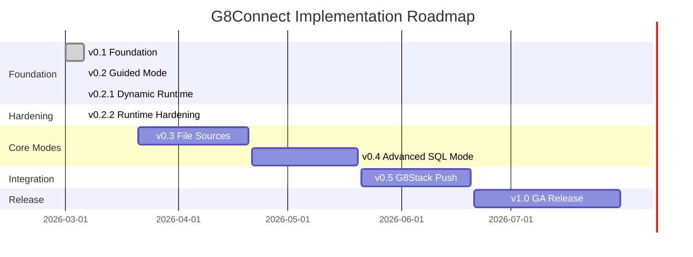
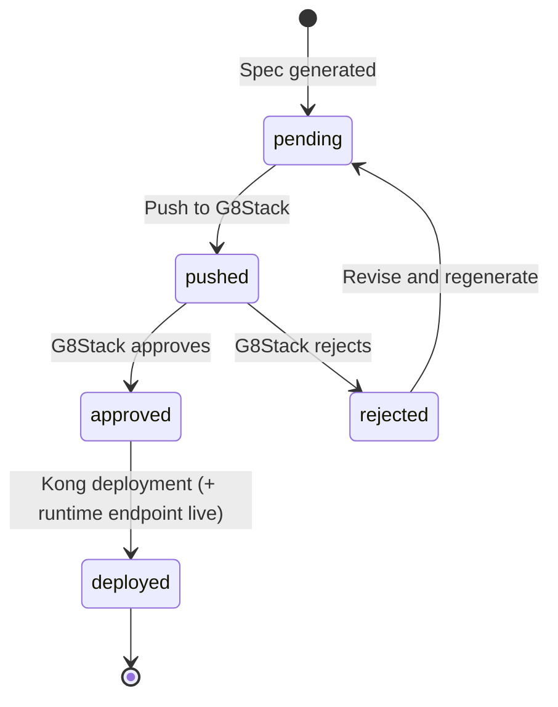
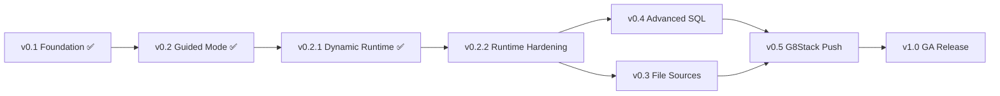

# Implementation Roadmap

G8Connect accelerates API creation from any data source while enforcing governance
through G8Stack. Every phase outputs drafts — nothing deploys without G8Stack approval.

> **Core principle**: Speed up API creation, don't skip governance.

## Phase Summary

| Phase | Name | Scope | Target | Status |
|---|---|---|---|---|
| v0.1 | Foundation | Auth + DB connections + Simple Mode | Internal / Dev | Done |
| v0.2 | Guided Mode | Field selection, methods, filters, versioning | Beta | Done |
| v0.2.1 | Dynamic Runtime | Serve deployed specs as live CRUD endpoints | Beta | Done |
| v0.2.2 | Runtime Hardening | Validation, security, headers, grouped specs | Beta | Done |
| v0.3 | File Sources | CSV, JSON, Excel | Beta | Planned |
| v0.4 | Advanced Mode | SQL queries to GET endpoints | GA prep | Planned |
| v0.5 | G8Stack Push | Spec submission + status tracking | GA | Planned |
| v1.0 | GA Release | Polish, audit, PII hardening, docs | Public | Planned |

## Timeline



## v0.1 — Foundation ✅

**Goal**: Connect to a database, introspect schema, expose all fields as a CRUD spec automatically. Simple Mode only.

**Status**: Complete (2026-03-06)

### Scope

- Project scaffolding (Laravel 12, Livewire, roles/permissions, Keycloak SSO skeleton)
- `DataSource` model — store connection config (type, `encrypted:array` credentials)
- Connectors: **PostgreSQL**, **MySQL**, **MSSQL**, **SQLite**
- Introspection: read tables, columns, data types (per-driver schema filtering)
- Simple Mode wizard:
  - Step 1: Connect (type, credentials, validate)
  - Step 2: Introspect (list tables)
  - Step 3: Pick table — auto-generate full CRUD spec (no config)
  - Step 4: PII column scan (flag, exclude by default)
  - Step 5: Review generated OpenAPI spec (read-only preview)
- `ApiSpec` model — store generated spec, status (`pending`), slug for runtime
- Basic RBAC: `superadmin`, `administrator`, `developer`, `viewer`
- Audit log: every connect + introspect action recorded

### Deliverables

```text
app/Services/Connectors/PostgresConnector.php
app/Services/Connectors/MySqlConnector.php
app/Services/Connectors/MssqlConnector.php
app/Services/Connectors/SqliteConnector.php
app/Services/Connectors/ConnectorFactory.php
app/Services/Connectors/AbstractDatabaseConnector.php
app/Services/Introspectors/DatabaseIntrospector.php
app/Services/PiiDetection/PiiDetectionService.php
app/Services/SpecGenerator/CrudSpecGenerator.php
app/Services/SpecGenerator/OpenApiSchemaMapper.php
app/Livewire/DataSource/ConnectWizard.php
app/Livewire/DataSource/Index.php
app/Livewire/DataSource/Show.php
app/Livewire/ApiSpec/Index.php
app/Livewire/ApiSpec/Show.php
app/Models/DataSource.php
app/Models/DataSourceSchema.php
app/Models/ApiSpec.php
app/Models/ConnectionAudit.php
app/Policies/DataSourcePolicy.php
app/Policies/ApiSpecPolicy.php
```

### Exit Criteria

- [x] All four DB connectors connect and introspect successfully
- [x] Simple Mode wizard generates valid OpenAPI 3.1 spec
- [x] PII columns auto-flagged and excluded from spec
- [x] Audit log records every connection attempt
- [x] Credentials encrypted at rest (`encrypted:array` cast), never logged
- [x] RBAC enforced on all data source operations

## v0.2 — Guided Mode ✅

**Goal**: Give developers control — pick tables, choose which fields to expose, select HTTP methods, add basic filters.

**Status**: Complete (2026-03-06)

### Scope

- Extend wizard with **Guided Mode** option after introspection
- Field configurator:
  - Toggle expose/exclude per column
  - Rename field (API name vs DB column name)
  - Mark as required / optional / read-only / filterable / sortable
- Method selector: choose which of `GET list`, `GET single`, `POST`, `PUT`, `PATCH`, `DELETE` to generate
- Basic filter config: allow filtering by selected columns (query params)
- Pagination config: page size, max limit
- `ApiSpecField` model — store per-field config per spec
- Preview: show 5-row sample based on field selection
- Spec versioning — regenerate spec if config changes (new version, not overwrite)

### Deliverables

```text
app/Services/SpecGenerator/GuidedSpecGenerator.php
app/Services/SpecVersioning/SpecVersioningService.php
app/Services/SpecGenerator/GuidedSpecGenerator.php  (supports multi-table via generateForTables())
app/Services/SpecVersioning/SpecVersioningService.php
app/Livewire/DataSource/GuidedConfigWizard.php
app/Livewire/ApiSpec/Manage.php           (create/edit with tabbed UI)
app/Livewire/ApiSpec/VersionHistory.php
app/Models/ApiSpecField.php
app/Models/ApiSpecTable.php               (per-table operations, resource names)
app/Models/ApiSpecVersion.php
app/Settings/ConnectionSettings.php
app/Settings/G8StackSettings.php
resources/views/api-specs/spec-viewer.blade.php  (Scalar API Reference viewer)
routes/web/api-specs.php                  (CRUD + preview + spec.json routes)
```

### Exit Criteria

- [x] Guided Mode wizard allows field-level configuration
- [x] Method selection generates correct OpenAPI operations
- [x] Filter and pagination config reflected in spec
- [x] Spec versioning creates new version on regenerate
- [x] Preview limited to 5 rows maximum
- [x] Multi-table spec generation — combined OpenAPI spec across all tables
- [x] Per-table operations (list, show, create, update, delete) on ApiSpecTable
- [x] API Spec create/edit UI with tabbed layout (Basic Info, Configuration, Resources)
- [x] Configure page with resource selector and per-table field configuration
- [x] Scalar API Reference viewer for interactive spec preview

## v0.2.1 — Dynamic API Runtime ✅

**Goal**: Serve deployed specs as live CRUD endpoints, turning G8Connect into an upstream service.

**Status**: Complete (2026-03-06)

### Scope

- Dynamic catch-all route under `/api/connect/{slug}` serving CRUD from deployed specs
- Header-based API versioning via `cleaniquecoders/laravel-api-version` (no version in URI)
- Runtime query builder: list (paginated, filterable, sortable), find, create, update, delete
- Response transformer: column-to-display-name mapping, input field filtering
- Auto-slug generation on `ApiSpec` model from name
- Method enforcement: only methods configured in spec are allowed

### Deliverables

```text
app/Http/Controllers/Api/V1/DynamicApiController.php
app/Services/ApiRuntime/ApiQueryService.php
app/Services/ApiRuntime/ApiResponseTransformer.php
routes/api.php
config/api-version.php
database/migrations/2026_03_06_100006_add_slug_to_api_specs_table.php
```

### Exit Criteria

- [x] Deployed specs serve live CRUD endpoints at `/api/connect/{slug}`
- [x] PII columns auto-excluded from runtime responses
- [x] Filtering, sorting, pagination work via query params
- [x] Only configured HTTP methods allowed per spec
- [x] Field display name mapping applied in responses

## v0.2.2 — Runtime Hardening

**Goal**: Make the dynamic API runtime production-ready — input validation, multi-table grouped specs, API security, and custom response headers.

### Scope

#### 1. CRUD Operation Control

Allow spec owners to choose exactly which operations are available per resource — not just enable/disable HTTP methods, but fine-grained control over Create, Read, Update, and Delete:

- **Per-resource toggle** — each table/resource in a spec can independently enable/disable C, R, U, D
- **Read sub-options** — `list` (GET collection) and `show` (GET single) can be toggled separately
- **Write restrictions** — allow Create but not Update, or Update but not Delete, etc.
- **Wizard integration** — checkboxes in both Simple and Guided Mode wizard
- **Simple Mode defaults** — Read-only (list + show) by default, user opts in to write operations
- **Guided Mode defaults** — all operations enabled, user can disable individually
- **Spec-level override** — `configuration.methods` sets the overall allowed methods
- **Resource-level override** — per-table operations stored in `ApiSpecTable.operations`
- **Runtime enforcement** — `DynamicApiController` checks both spec-level and resource-level before executing

```php
// Per-resource operation config (stored in api_spec_tables.operations)
'operations' => [
    'create' => true,    // POST
    'list'   => true,    // GET collection
    'show'   => true,    // GET single
    'update' => false,   // PUT — disabled
    'delete' => false,   // DELETE — disabled
],

// API response when disabled operation is attempted:
// 405 Method Not Allowed
{
    "message": "This operation is not available for this resource."
}
```

> **Rule:** Default to read-only. Write operations (Create, Update, Delete) should be
> explicitly opted-in, never automatically enabled. This protects source databases from
> accidental writes through the API.

#### 2. Input Validation (write operations only)

Runtime endpoints currently accept any input. Add validation before data hits the database:

- **Type validation** — enforce data types from introspected schema (string, integer, date, etc.)
- **Required fields** — validate required columns on `POST`/`PUT` based on `ApiSpecField.is_required`
- **Max length / numeric range** — derive from DB column definitions (varchar length, int precision)
- **Unique constraints** — validate uniqueness for columns marked unique in schema
- **Custom validation rules** — allow per-field rules in `ApiSpecField` config (regex, in-list, etc.)
- **Validation error response** — standard JSON format with field-level errors (422 Unprocessable Entity)

```php
// Expected validation error response
{
    "message": "Validation failed.",
    "errors": {
        "email": ["The email field must be a valid email address."],
        "name": ["The name field is required."]
    }
}
```

#### 3. Resource & Field Remapping

Never expose raw database table or column names in the API. Remap everything to clean, secure, domain-relevant names:

- **Table → Resource name** — `tbl_usr_accounts` → `users`, `emp_department_v2` → `departments`
- **Column → Field name** — `usr_email_addr` → `email`, `ic_no` → removed or remapped
- **Auto-suggest** — strip common prefixes (`tbl_`, `tb_`, `t_`), convert to plural resource names
- **Manual override** — user can set any display name during wizard
- **Stored in `ApiSpecField`** — `column_name` (internal) vs `display_name` (API-facing)
- **Stored in `ApiSpecTable`** — `table_name` (internal) vs `resource_name` (API-facing)
- **Bidirectional mapping** — input accepts remapped names, output uses remapped names
- **Internal names never leak** — error messages, headers, and logs use remapped names only

```php
// Database reality:
// Table: tbl_emp_records
// Columns: emp_id, emp_full_name, emp_email_addr, emp_ic_no, emp_dept_code

// API surface after remapping:
// Resource: employees
// Fields: id, full_name, email, department_code
// (emp_ic_no excluded — PII flagged)

GET /api/connect/hr-system/employees
{
    "data": [
        {
            "id": 1,
            "full_name": "Ahmad bin Hassan",
            "email": "ahmad@company.com",
            "department_code": "ENG"
        }
    ]
}
```

> **Rule:** Column remapping already exists in `ApiSpecField.display_name` for Guided Mode.
> This extends it to table-level remapping and makes it the default behaviour — not opt-in.
> Simple Mode should auto-suggest clean names, not blindly copy DB names.

#### 4. Grouped API Spec (Multi-Table)

Currently each spec maps to a single table. Allow grouping multiple tables under one spec slug:

- **Multi-table selection** — select multiple tables during wizard (Simple & Guided)
- **Nested endpoints** — `/api/connect/{slug}/{resource}` using remapped resource names (never raw table names)
- **Root spec info** — `GET /api/connect/{slug}` returns available resources in the group
- **Per-table field config** — each table has its own `ApiSpecField` entries with remapped names
- **Shared configuration** — methods, pagination, auth settings apply to entire spec group
- **Relationship hints** — optional FK-based linking between resources (read-only, no auto-joins)

```
# Database tables: tbl_emp_records, tbl_dept_master, tbl_positions
# After remapping:

GET  /api/connect/hr-system              → list available resources
GET  /api/connect/hr-system/employees    → list employees (from tbl_emp_records)
GET  /api/connect/hr-system/departments  → list departments (from tbl_dept_master)
GET  /api/connect/hr-system/employees/5  → single employee
POST /api/connect/hr-system/employees    → create employee
```

#### 5. API Security

Secure the `/api/connect/` endpoints — currently open to anyone:

- **API Key authentication** — per-spec API keys stored in `api_spec_keys` table
- **Key management UI** — generate, revoke, regenerate keys per spec
- **Rate limiting** — per-key throttle (configurable per spec, default 60 req/min)
- **IP allowlist** — optional IP restriction per spec
- **CORS configuration** — per-spec allowed origins (default: same-origin)
- **Request logging** — log every API call (method, path, key, IP, status, latency)

```php
// api_spec_keys table
Schema::create('api_spec_keys', function (Blueprint $table) {
    $table->uuid('id')->primary();
    $table->foreignUuid('api_spec_id')->constrained()->cascadeOnDelete();
    $table->string('name');               // "Production Key", "Dev Key"
    $table->string('key_hash')->unique(); // hashed API key
    $table->string('key_prefix');         // first 8 chars for identification
    $table->integer('rate_limit')->default(60); // requests per minute
    $table->json('allowed_ips')->nullable();
    $table->json('allowed_origins')->nullable();
    $table->timestamp('expires_at')->nullable();
    $table->timestamp('last_used_at')->nullable();
    $table->timestamps();
    $table->softDeletes();
});
```

#### 6. Custom Response Headers

Allow spec owners to configure custom headers on API responses:

- **Standard headers** — `X-Request-Id`, `X-Response-Time`, `Cache-Control`
- **Configurable headers** — per-spec custom headers stored in `configuration` JSON
- **Security headers** — `X-Content-Type-Options: nosniff`, `X-Frame-Options: DENY` (always on)
- **Pagination headers** — `X-Total-Count`, `X-Page`, `X-Per-Page` in addition to body meta
- **CORS headers** — `Access-Control-Allow-Origin`, `Access-Control-Allow-Methods` based on spec config

```php
// Stored in api_specs.configuration
'headers' => [
    'X-Powered-By' => 'G8Connect',
    'Cache-Control' => 'no-cache',
    'custom' => [
        'X-Department' => 'Engineering',
    ],
],
```

### Deliverables

```text
app/Services/ApiRuntime/ApiValidationService.php
app/Services/ApiRuntime/ApiSecurityMiddleware.php
app/Services/ApiRuntime/ApiHeaderService.php
app/Services/ApiRuntime/ResourceNameSuggester.php
app/Models/ApiSpecKey.php
app/Models/ApiSpecTable.php
app/Livewire/ApiSpec/KeyManagement.php
app/Livewire/ApiSpec/ResourceMapper.php
database/migrations/xxxx_create_api_spec_keys_table.php
database/migrations/xxxx_create_api_spec_tables_table.php
```

### Exit Criteria

- [ ] Per-resource CRUD toggle — each operation independently enable/disable
- [ ] Default to read-only — write operations require explicit opt-in
- [ ] Disabled operations return 405 with clear message
- [ ] Wizard UI shows CRUD checkboxes per resource (Simple + Guided)
- [ ] Table names remapped to clean resource names — raw DB names never in API responses
- [ ] Column names remapped via `display_name` — raw DB column names never exposed
- [ ] Simple Mode auto-suggests clean resource/field names (strip prefixes, pluralise)
- [ ] Error messages and validation use remapped names, never internal column names
- [ ] POST/PUT requests validate input against schema-derived rules
- [ ] Validation errors return 422 with field-level messages (using remapped names)
- [ ] Multi-table specs serve nested endpoints under one slug using resource names
- [ ] `GET /api/connect/{slug}` returns resource listing for grouped specs
- [ ] API key auth enforced — unauthenticated requests return 401
- [ ] Rate limiting returns 429 with `Retry-After` header
- [ ] Custom headers appear in all API responses
- [ ] Security headers (`X-Content-Type-Options`, `X-Frame-Options`) always present
- [ ] Request logging captures method, path, key, IP, status, latency
- [ ] Key management UI allows generate, revoke, regenerate

### What's NOT in v0.2.2

- No OAuth2 / JWT — API key is sufficient for now
- No auto-join across tables — relationship hints are informational only
- No webhook on API key events — just audit log
- No per-endpoint rate limits — rate limit is per key, per spec

---

## v0.3 — File Sources

**Goal**: Upload CSV, JSON, or Excel files — get a read-only API draft from the data.

### Scope

- File connector: upload via UI, store via Spatie MediaLibrary
- Supported: **CSV**, **JSON**, **Excel (.xlsx)**
- File introspection:
  - CSV/Excel: detect headers, infer column types
  - JSON: detect top-level array structure, infer field types
- Auto-generate read-only spec (GET list + GET single only — no writes from files)
- Row limit enforced at draft level (configurable via Settings)
- File-sourced specs labelled clearly — approvers in G8Stack can see source type
- Temp file cleanup after introspection (don't persist raw uploads long-term)

### Deliverables

```text
app/Services/Connectors/CsvConnector.php
app/Services/Connectors/JsonConnector.php
app/Services/Connectors/ExcelConnector.php
app/Services/Introspectors/FileIntrospector.php
app/Livewire/DataSource/FileUploadWizard.php
```

### Exit Criteria

- [ ] CSV, JSON, and Excel files upload and introspect correctly
- [ ] Column types inferred accurately from file content
- [ ] Generated drafts are read-only (GET endpoints only)
- [ ] Source type label included in draft metadata
- [ ] Temp files cleaned up after processing

### Notes

> File sources only support Simple Mode and Guided Mode field selection.
> SQL Mode does not apply to file sources.

## v0.4 — Advanced Mode (SQL to GET)

**Goal**: Developers write a SELECT query — it becomes a named GET endpoint with query parameters.

### Scope

- SQL editor in wizard (Advanced Mode)
- Query parser — validate only SELECT statements:
  - Block: `INSERT`, `UPDATE`, `DELETE`, `DROP`, `TRUNCATE`, `ALTER`
  - Block: access to `information_schema`, `pg_catalog`, `sys`, `mysql`
  - Allow: `SELECT`, `WITH` (CTE), `JOIN`, subqueries on app tables only
- Named query: developer sets endpoint name — `/api/{name}`
- Parameter binding: `?` or `:param` in SQL — becomes query param in OpenAPI spec
- Query dry-run: execute with LIMIT 5, show result shape (no data shown to user)
- Row cap: enforce max rows via Settings even on custom SQL
- PII scan on result columns (same service, same rules)
- Only generates `GET` endpoint — no writes

### Deliverables

```text
app/Services/SqlValidator.php
app/Services/DraftGenerator/SqlDraftGenerator.php
app/Livewire/DataSource/SqlQueryWizard.php
```

### Security Constraints (hardcoded, not configurable)

| Constraint | Value |
|---|---|
| Parser mode | Whitelist — reject anything not explicitly allowed |
| Connection | Always read-only (enforced at connector level) |
| Query timeout | 10 seconds max |
| Result cap | 1000 rows max regardless of query |

### Exit Criteria

- [ ] SQL validator blocks all non-SELECT statements
- [ ] System table access blocked (`information_schema`, `pg_catalog`, etc.)
- [ ] Named endpoints generate correct OpenAPI spec
- [ ] Parameter binding produces query parameters in spec
- [ ] Timeout and row cap enforced at query level
- [ ] PII scan applied to result columns

## v0.5 — G8Stack Push

**Goal**: Submit specs to G8Stack governance workflow. Track approval status.

### Scope

- `G8StackService` — push OpenAPI spec via G8Stack API
- Push is **queued** (Laravel job) — never synchronous in request cycle
- Spec status tracking: `pending` → `pushed` → `approved` / `rejected` → `deployed`
- Webhook receiver: G8Stack posts back status updates
- UI: spec list shows current status, last pushed at, approved/rejected by
- Re-push on rejection: developer can revise config and resubmit
- G8Stack connection settings UI (Admin > Settings > G8Stack):
  - Endpoint URL
  - API token (encrypted via Spatie Settings)
  - Push enabled toggle

### Deliverables

```text
app/Services/G8StackService.php
app/Jobs/PushSpecToG8Stack.php
app/Http/Controllers/Webhook/G8StackWebhookController.php
app/Settings/G8StackSettings.php
```

### Spec Status Flow



### Exit Criteria

- [ ] Specs push to G8Stack via queued job
- [ ] Failed jobs retry 3 times with exponential backoff
- [ ] Webhook updates spec status in real-time
- [ ] UI shows current status for all specs
- [ ] Push failures surface clearly — never silent fail
- [ ] Admin notified on final retry failure

## v1.0 — GA Release

**Goal**: Production-ready. Hardened security, full audit, documented, demo-ready for prospects.

### Scope

- Full audit trail UI (who connected, introspected, generated, pushed)
- PII detection improvements — configurable patterns per organisation
- Connection health check — periodic ping to verify data source still reachable
- Spec expiry — specs older than X days prompt re-validation before push
- Multi-org support (basic) — data sources scoped to team/organisation
- Read-only connection enforcement validator — warn if account has write grants
- Rate limiting on introspection/preview endpoints
- Full test coverage (feature + unit, Pest)
- Docs: user guide, admin guide, G8Stack integration guide
- Demo seed data — realistic but fake data sources for prospects

### Hardening Checklist

- [ ] All credentials encrypted at rest
- [ ] No credential values in logs (tested)
- [ ] Preview max rows enforced at DB query level (not just UI)
- [ ] SQL validator test suite — known attack patterns blocked
- [ ] PII patterns reviewed against Malaysian data sensitivity context (NRIC, passport, bank)
- [ ] Audit log immutable (append-only, no soft deletes)
- [ ] Webhook endpoint signature verification (G8Stack signs payloads)

### Exit Criteria

- [ ] All hardening checklist items pass
- [ ] Full test suite with coverage target met
- [ ] User guide, admin guide, and integration guide complete
- [ ] Demo environment with seed data operational
- [ ] Multi-org data isolation verified

## Dependency Map



## Data Source Roadmap

| Phase | Sources |
|---|---|
| v0.1-v0.2 | PostgreSQL, MySQL, MSSQL, SQLite |
| v0.3 | CSV, JSON, Excel (.xlsx) |
| Post-v1.0 | MongoDB, Redis, XML, Parquet, REST/SOAP, S3/MinIO, Google Sheets, SFTP |

## What's Next — v0.2.2 Runtime Hardening

Priority order for v0.2.2:

1. **Input Validation** — validate POST/PUT against schema-derived rules (type, required, length)
2. **API Security** — API key auth, rate limiting, CORS for `/api/connect/` endpoints
3. **Grouped Specs** — multi-table support under one slug with nested endpoints
4. **Response Headers** — security headers, custom headers, pagination headers

### Suggested Implementation Order

```
Step 1:  CRUD operation control (per-resource toggles, default read-only, 405 enforcement)
Step 2:  Resource & field remapping (ApiSpecTable model, ResourceNameSuggester, update transformer)
Step 3:  ApiValidationService + schema-derived rules (using remapped names, write ops only)
Step 4:  api_spec_keys migration + ApiSpecKey model + auth middleware
Step 5:  Rate limiting middleware (per-key throttle)
Step 6:  Multi-table spec support (grouped endpoints, nested routing)
Step 7:  ApiHeaderService + security headers + custom headers
Step 8:  Key management UI + resource mapper UI + CRUD toggles UI (Livewire)
Step 9:  Request logging
Step 10: Tests for all above
```

## References

- [Decision Log](02-decision-log.md)
- [Architecture Overview](../03-architecture/README.md)
